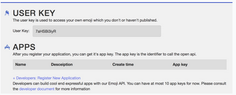
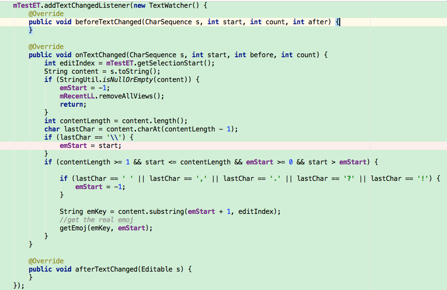
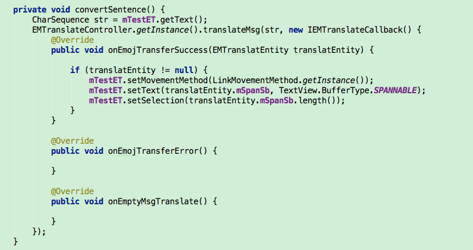
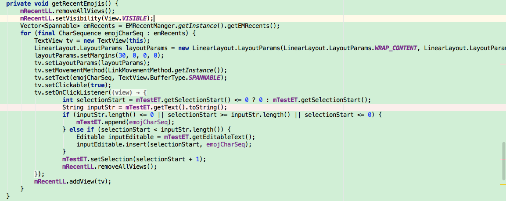
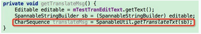
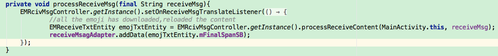

# emojier android sdk
A emoji sdk, you can define your own emoji and translate the text to it.


If you want to use the function you need to execute some steps.
###Preparation before integration
####Register and Apply AppKey
Click register on Emojier’s [official website](http://www.emojier.net/), then it will jump to the administration back-end registration page, as shown in the picture below: 

As a developer ,you need Apply the AppKey And UserKey in your dashboard.



Now ,what you need to do is configure the APPKEY to Android.
###Download SDK
Download Emoji SDK from the  [official website](http://www.emojier.net/).
 By now, you have downloaded the SDK and are ready to learn how to use and integrate the SDK. Let’s get started!
####Import sdk
In the apps developed by developers, you should depend on the emojisdk library in your own project.And you need config your **build.gradle** 
```
dependencies {
    compile project(':emojsdk')
}
```

####Config Your AppKey
Before you use the sdk,you must call the method of **EMLogicManager**which is single instance to config the app key which you apply on our website.
```
/**
appKey:the appkey which you apply
*/
EMLogicManager.getInstance().setAppKey(String appKey);
```
###Config The UserKey
If you want use the emoji that custome ,you should  config the user key which have applyed on our website.This method also appear in the **EMLogicManager**.
```

###Init The Config
Pls don't forget do this,before you begin develope your app. You'd better do this in SplashActivity.
```
   EMLogicManager.getInstance().init();
   DbOpenHelper.getInstance(Context context);
```
/**
userKey:which used for get the custome emoji
*/
EMLogicManager.getInstance().setUserKey(String userKey);
```

###Download Emoji Keys
 If you want to use our interesting emoji ,you sholud get our emoji keys,it's really simple.
```
EMLogicManager.getInstance().getAllEmKeys();
```
###Convert one word into emoji
The most important method is the follow,before you get the related emoji,you need set the **OnEMResponseListener**,if you get the real emoji, the **onEMRespSpanSb(EMCandiateEntity emCandiateEntity) ** would be called, in this callback method ,you can write you code for display the real emoji,we supply the default implement of the callback ***DefaultEMResponse**,you must call the **super.onEMRespSpanSb(candiateEntity)**.
```
EMLogicManager.getInstance().setEMRespSpanListener(new DefaultEMResponse() {
   @Override
  public void onEMRespSpanSb(EMCandiateEntity canEntity){
         super.onEMRespSpanSb(candiateEntity);
         //do how you want to display the emoji
  }

  @Override
  public void onEMRespnSpanError(Exception exp) {
  }
});
//emKey:the word which you want to convert
//keyStart:the positio of the word
EMLogicManager.getInstance().requestForEmoj(emKey,keyStart);
```

When you want to convert some word to releated emoji,you also need to know the position of the word.For Example:


when the real emoji return, will execute the callback method,


###Convert one sentence into emji 
If you want to convert one sentence,you need to call the method of the **EMTranslateController**,which is a single instance.Please focus the **IEMTranslateCallback**.
```
public interface IEMTranslateCallback {
    /**
    if all the key has been translated,will call this method.
    translatEntity:which contains the emoji spannable
    */
    void onEmojTransferSuccess(EMTranslatEntity translatEntity);
    void onEmojTransferError();
    void onEmptyMsgTranslate();
}
/**
 sentenceStr : the sentence which you want to translate. 
translateCallback:when all the emoji have prepared,the callback will be executed.
*/
EMTranslateController.getInstance().translateMsg(CharSequence sentenceStr,IEMTranslateCallback translateCallback);
```
We  supply the simple example,hope useful for you.



###The  recent emojis
When you want to get the emojis which you recent used, just call the follow method.
```
EMRecentManger.getInstance().getEMRecents()
```
Follow is the simple example:



###Get the real transfer content
If the message which you want to send that contains our emoji,then before you really sent,you need call the follow method which converts the emoji into our protocol message,so we can recoginze it later.
```
/**
content:the Spannable which contains emoji and text.
*/
public static CharSequence getTranslateTxt(SpannableStringBuilder content)
```
Follow is our simple example



###Process the receive message
when you receive the message which contains our emoji ,you need call this method to convert the message to emoj.
```
/**
msgStr: the text message which need to convert.
*/
public EMReceiveTxtEntity processReceiveContent(Context ctx, String msgStr)
```
Before call this method ,you need set the callback so when all the emoji are downloaded, you can repalce the display content.
```
/**
msgTranslateListener:the callback interface,you can reload the content which will display the emoji
*/
public void setOnReceiveMsgTranslateListener(IReceiveMsgTranslateListener msgTranslateListener)
```
Follow is our example:



###Custom set the size of the emoj span
If you want to custom define the emoji size,you need call this method of **EMLogicManager**.
```
/**
emojSize: which determin the real size of the emoji span,if you set -1,we will use the default value.
*/
public void setEmojiSize(int emojiSize);
```
###Config max emoji buffer
You can call this method to config the max emoji buffer,if exceed it will delete the reduancy emoji.
```
/**
maxVaule: the max size of the emoji buffer,which takes a value in M
*/
EMLogicManager.getInstance().setMaxEmojiBuffer(int maxVaule).
```
### Adv Link
It's the online emoji's property. For example,You send a emoji cookie to Someone,who want to know where to buy it, he can just tap the emoji of cookie he has received, then he can open the link, and see the sale information on a website. If you want you emoji could be click,then you need call the method.
```
mTextView.setMovementMethod(EMLinkMovementMethod.getInstance());
```
### Clear all the emoji cache
If you want delete all the emojis which cached to local.you need call the method.
```
CommUtil.clearAllEmojImgs();
```


